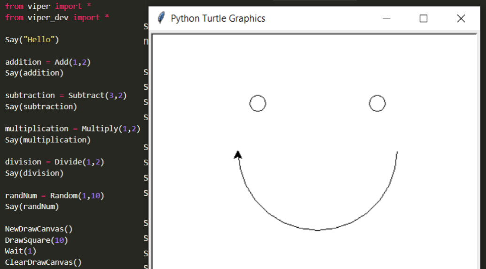

# Viper
🚀 Python-based programming language for beginners transitioning from block programming languages

In order to install this project on your computer, you must have Python 3.7+ installed. See the respective guides to see how to do this: [MacOS](#macos), [Windows](#windows10).

## MacOS
1. Open the `Terminal` app by pressing and holding `Command+Space`
2. Install the `Homebrew` package manager by entering the following command: `$ ruby -e "$(curl -fsSL https://raw.githubusercontent.com/Homebrew/install/master/install)"`
3. Add the `brew` binary to your `PATH` environment variable by running `export PATH="/usr/local/opt/python/libexec/bin:$PATH"` (If you're using MacOS 1.13+). If you're running MacOS 1.12 or lower, run `export PATH=/usr/local/bin:/usr/local/sbin:$PATH`
4. Finally, run `brew install python3`
5. To make sure your installation worked, run `python3 -v` in your terminal. If it doesn't, refer to the [Python Documentation](https://docs.python-guide.org/starting/install3/osx/) for more information

## Windows 10
1. Open the `PowerShell` app with administrative access
2. Run the following command: `Set-ExecutionPolicy Bypass -Scope Process -Force; [System.Net.ServicePointManager]::SecurityProtocol = [System.Net.ServicePointManager]::SecurityProtocol -bor 3072; iex ((New-Object System.Net.WebClient).DownloadString('https://chocolatey.org/install.ps1'))`
3. Run the following command: `choco install python`
4. To make sure your installation worked, run `python3 -v` in your terminal. If it doesn't, refer to the [Python Documentation](https://docs.python-guide.org/starting/install3/win/) for more information

Nice! You have now successfully installed Python on your computer. Before you start, the `turtle` module for Python is required. In order to do this, you need to run the `pip3 install turtle` command.

Time to install viper! To do this, you can select `Clone or download > Download ZIP`. Then, extract the ZIP file into a directory of your choice.

## Basic Programs
In order to start a `viper` program, add `import viper` to the top of your file and start programming! You can check out the [sample program](https://github.com/safinsingh/viper/blob/master/sample_program.py) to see an example of all of the functions. For more detailed explanations of all the functions, head over to the [Wiki Page](https://github.com/safinsingh/viper/wiki).

## Developer Tools
At the moment, the only developer tool that `viper` provides is to view the source code of functions. To do this within the program, import the `viper_dev` module. To add custom functions, feel free to edit `viper.py` and add a PR.
